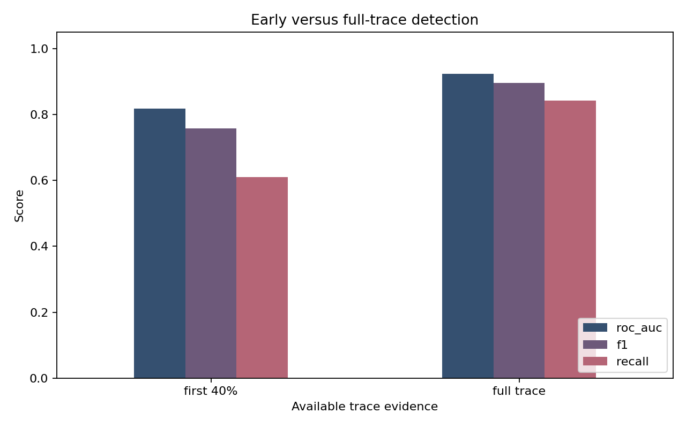
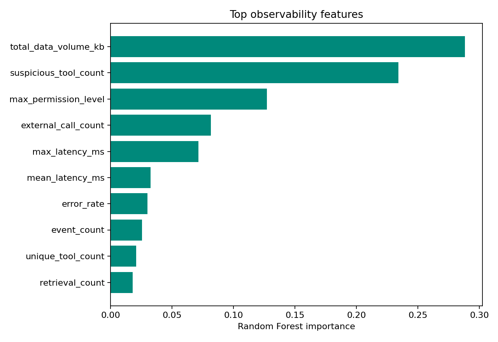

# LLM Agent Observability

> Privacy-aware detection of compromised multi-agent AI sessions from runtime metadata.

## Problem

Multi-agent AI systems delegate tasks, retrieve documents, and invoke tools. A compromise can emerge across several individually plausible actions, while prompts and responses may contain private or regulated content. This project asks whether runtime metadata alone can support behavioral detection.

The pipeline generates synthetic benign and compromised agent traces, aggregates content-free observability features, and compares full-trace detection with a model trained on the first 40% of each trace.

## What this project demonstrates

- Structured event design for multi-agent AI observability
- Privacy-aware feature engineering without prompt or response text
- Behavioral signals spanning agents, tools, retrieval, permissions, latency, and data movement
- Session-level classification with stratified evaluation
- An honest early-detection experiment using separately trained partial-trace models
- Model interpretation through global feature importance
- Reproducible synthetic data and automated tests

## Trace schema

Each row records content-free runtime metadata:

- session and step identifiers
- agent, action, and tool names
- latency and data volume
- permission level, external destination, and error indicator
- session label used only for evaluation

No prompt or model-response text is collected.

## Quick start

```bash
python -m venv .venv
python -m pip install -r requirements.txt
python src/run_pipeline.py
python -m unittest discover -s tests -v
```

On Windows PowerShell, activate the environment with `.venv\Scripts\Activate.ps1`.

## Outputs

- `data/agent_events.csv`
- `results/full_trace_features.csv`
- `results/early_trace_features.csv`
- `results/full_metrics.json`
- `results/early_metrics.json`
- `results/metrics_comparison.csv`
- `results/confusion_matrix.png`
- `results/feature_importance.png`
- `results/early_vs_full.png`

## Results

Both models used the same 375 held-out sessions:

| Available evidence | ROC-AUC | F1 | Recall |
|---|---:|---:|---:|
| First 40% of trace | 0.818 | 0.757 | 0.609 |
| Full trace | 0.923 | 0.896 | 0.842 |

The gap quantifies the tradeoff between intervention time and available evidence. The early model provides useful ranking performance, while the full trace improves both coverage and classification quality.





## Evaluation design

The same held-out session IDs are used for the full- and partial-trace experiments. Each model is trained on the amount of evidence available at its intended decision point. This avoids training on complete traces and pretending that truncated test traces have the same feature distribution.

## Limitations

The traces and compromise patterns are synthetic. The project demonstrates a methodology, not a production security control. Real deployment would require data from diverse agent frameworks, temporal validation, drift monitoring, threshold selection, red-team coverage, and human review of alerts.

## Research connection

This is an independent, simplified portfolio demonstration inspired by Elnaz Rabieinejad's published research on log-based detection for multi-agent LLMs. It is not the ALTEDA implementation and does not reproduce the paper's data, code, or reported results.

Related publication: [Beyond the Prompt: Log-Based Threat Detection and Attribution for Multi-Agent LLMs](https://doi.org/10.1016/j.ipm.2026.104768).
